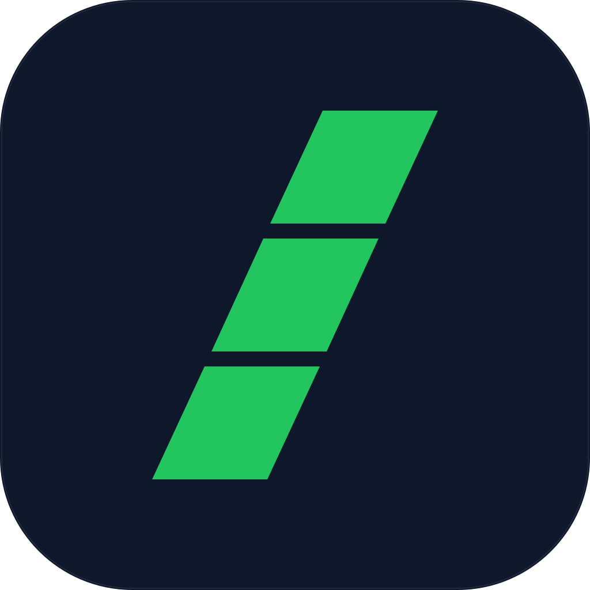

<div align="center">



# Skills Bank

One registry. Every AI agent on your machine.

[](https://github.com/Tyler-Reagan/skills-bank/releases)
[](LICENSE)


</div>


A **skill** is a folder with a `SKILL.md` — instructions plus metadata in YAML frontmatter — that an AI coding agent reads at runtime to gain a specialized capability. Skills Bank keeps your collection in sync across Claude Code, Cursor, Gemini, GitHub Copilot, Continue, Cline, and Codex — using symlinks, so there are no copies and no drift. Skills are automatically organized by category (frontend, backend, AI tooling, and more) and tagged based on their name and description; both are editable per-skill from the detail drawer.

## Get started

### Desktop app

Download the latest DMG from the [Releases page](https://github.com/Tyler-Reagan/skills-bank/releases):

- `Skills-Bank-<version>-arm64.dmg` — Apple Silicon
- `Skills-Bank-<version>-x64.dmg` — Intel

Drag to Applications, launch from Spotlight. Signed and notarized — Gatekeeper opens on a normal double-click. Auto-updates on launch.

**Uninstall:** run [`scripts/uninstall.sh`](scripts/uninstall.sh) from a clone (`--dry-run` to preview, `--keep-data` to keep your registry). It removes the app, its data/caches, and only the agent symlinks it created. See [Uninstalling Skills Bank](https://skills-bank-desktop.vercel.app/reference/troubleshooting#uninstalling-skills-bank).

> [!TIP]
> **📖 Read the docs: [skills-bank-desktop.vercel.app](https://skills-bank-desktop.vercel.app/)** — the source of truth for getting started, concepts, guides, and reference. The markdown sources live under [`packages/docs/`](packages/docs/) if you want to edit them.

### CLI

```bash
pnpm install && pnpm run build
node packages/cli/dist/index.js list [--json]
node packages/cli/dist/index.js install <name> [--agent <id>]
node packages/cli/dist/index.js uninstall <name> [--agent <id>]
node packages/cli/dist/index.js installed [--json]
node packages/cli/dist/index.js path <name>
```

## What's in this repo

| Path                                   | Purpose                                                                           |
| -------------------------------------- | --------------------------------------------------------------------------------- |
| [`skills/`](skills/)                   | Bundled registry — one folder per skill, each a `SKILL.md` with YAML frontmatter. |
| [`packages/core`](packages/core)       | Shared TypeScript library: registry IO, install, sync, registration.              |
| [`packages/cli`](packages/cli)         | The `skills-bank` CLI — five commands for shell composition.                      |
| [`packages/desktop`](packages/desktop) | Electron + React desktop app.                                                     |
| [`packages/docs`](packages/docs)       | VitePress docs site.                                                              |

## Local development

```bash
pnpm install
pnpm dev      # watch renderer, launch Electron with devtools
pnpm start    # one-shot production build, then launch
```

> [!TIP]
> Set `SKILLS_BANK_ROOT=/path/to/skills-bank` to work against the cloned `skills/` folder directly. On a fresh clone, run `pnpm reset:seed` once first.

```bash
pnpm docs:dev   # run the docs site locally
```

## Adding a registry skill

Drop a folder at `skills/<name>/` with a `SKILL.md` whose YAML frontmatter matches [`docs/meta-schema.json`](docs/meta-schema.json), then:

```bash
pnpm validate && pnpm build:index
```

## Cutting a release

Releases are tag-driven. Merge the feature PR, bump the version in all `package.json` files (`./`, `packages/core`, `packages/desktop`, `packages/cli`) and update `CHANGELOG.md`, then commit as `chore: release vX.Y.Z`, tag, and push `vX.Y.Z`. The [release workflow](.github/workflows/release.yml) builds signed + notarized DMGs and creates a draft; publish the draft from the GitHub UI to ship.

See [`CLAUDE.md`](CLAUDE.md) for the full release checklist and agent-facing scripts.
