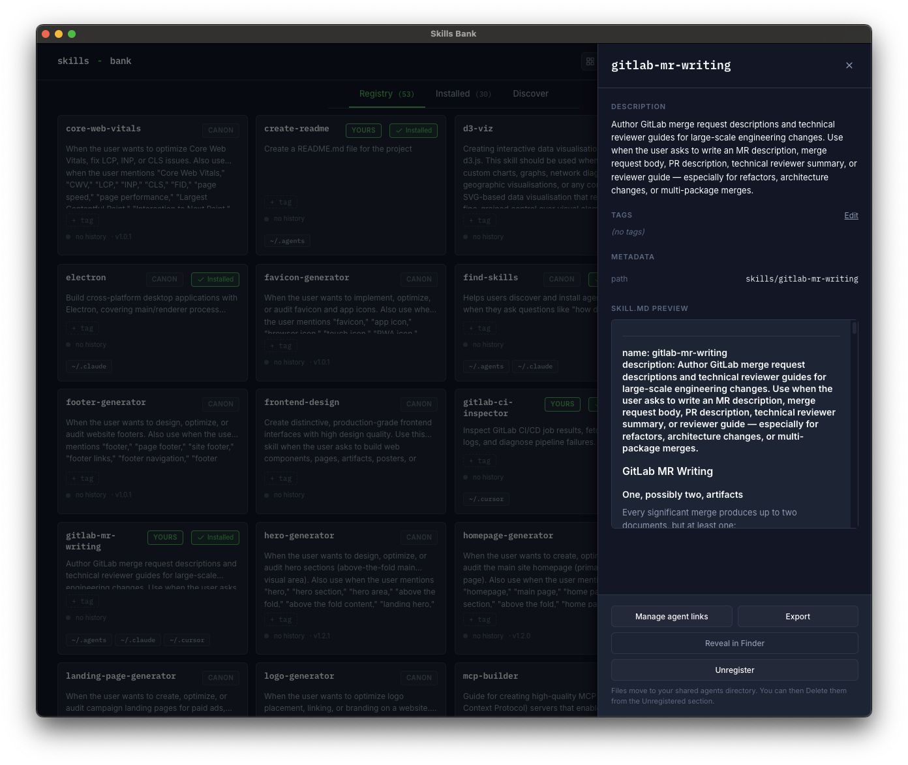

# Concepts

The vocabulary the app uses, defined in one place. Skim this once and the rest of the docs (and the UI itself) become a lot more obvious.

> [!NOTE]
> This document is the user-facing concept guide. The engineering glossary — including precise "aliases to avoid" lists, the canonical operation verbs, and flagged ambiguities the codebase has worked through — lives in [`UBIQUITOUS_LANGUAGE.md`](../UBIQUITOUS_LANGUAGE.md) at the repo root. When the two documents disagree, UL is canonical; this doc gets rewritten to match.

## Taxonomy

Every skill the app knows about sits on four orthogonal axes. Operations and UI gating derive from these axes, not from ad-hoc per-component checks.

- **Source (provenance)** — binary user-facing axis. Either `bundled` (came from the curated set this app ships with) or `yours` (you added it, however it got there). See [Source (provenance)](#source-provenance) below for full surface behavior. The codebase also carries an internal-only `entry.canon` boolean — "is this name currently in the upstream bundled snapshot?" — used only to gate destructive-action protection. It never surfaces to the user.
- **Registered** — boolean. The skill has an entry in the local registry index. Mutated freely. Holds local-only metadata (tags, install paths, the Adopted flag).
- **Adopted** — boolean on each registry entry. When `true`, the skill's files physically live under `<registryRoot>/skills/<name>/`. When `false`, the registry entry tracks an external location and the files stay where they are. Default at register time is the `registerAdopts` setting (default `true`).
- **Installed** — derived from on-disk scan. A skill is installed if at least one agent dir contains an entry at `<agentDir>/<name>`. Per-agent kinds: `ours`, `foreign-symlink`, `real-directory`, `broken-symlink`.

### Derived rules

- Bundled skills are registered by default. Unregister and delete of bundled skills are prohibited; the user-visible escape is **Dismiss from registry view**, scoped per linked-registry.
- A registered but uninstalled `yours` skill is valid. Re-install requires the original source (no upstream to pull from).
- Registered + broken/conflicting installations ⇒ heal flow with explicit choices.
- Unregister of an adopted skill expels its files to the `unregisterDestinationAgent` setting (default `~/.agents/skills/`). Unregister of a non-adopted skill removes the index entry; origin files are untouched.

### Lifecycle

The four axes are orthogonal, but a skill's lifecycle reduces to a small ladder: **Unmanaged → Registered → Unregistered → Deleted**. Provenance (bundled/yours), Adopted, External, and Dismissed are _attributes_ of the Registered position, not separate lifecycle states. The diagram below shows that ladder and pulls the heal-pending states (highlighted) out as side arms so the recovery actions are visible.

Labels match the in-app vocabulary: nodes are lifecycle positions, transitions are the action buttons that move a skill between them. The dimensions the diagram doesn't show — _whether_ a Registered skill is bundled or yours, adopted or external — are read off the [Source (provenance)](#source-provenance) and [card badges](#card-badges) sections.

### Destructive-action ladder

Three actions form an escalation, with distinct file/recovery semantics. Each tier physically separates from the next: Delete is only reachable on **unregistered** skills, so the user must Unregister first.

| Action                            | Where                                                                               | Files                                                               | Agent symlinks                                                          | Recovery                                      |
| --------------------------------- | ----------------------------------------------------------------------------------- | ------------------------------------------------------------------- | ----------------------------------------------------------------------- | --------------------------------------------- |
| Manage agent links                | Drawer                                                                              | untouched                                                           | added/removed per-agent via checkboxes (untick all = full uninstall)    | re-add via the same modal                     |
| [Unregister](flows/unregister.md) | Drawer                                                                              | adopted: moved to the configured agents dir; non-adopted: untouched | adopted: rewritten to point at the new location; non-adopted: untouched | re-register from new location                 |
| Delete                            | Installed tab → Unregistered section (inline button on the card, with confirmation) | real-directory copies removed; symlink targets preserved            | symlinks unlinked                                                       | bundled: re-pull; yours: gone (modulo export) |

Bundled skills are exempt: Unregister and Delete are prohibited entirely. Use **Dismiss from registry view** instead — see [personas.md](personas.md#canon-protection-hide-instead-of-unregisterdelete).

## Skill

A folder containing instructions (`SKILL.md`) and optional metadata (`meta.json`) that an AI agent — Claude Code, Cursor, Gemini, etc. — picks up at runtime to gain a specialized capability. A skill is just files on disk; nothing about it requires this app to exist.

## Agent directory

Every supported AI agent reads skills from a fixed directory under your home folder:

| Agent          | Directory             |
| -------------- | --------------------- |
| Claude Code    | `~/.claude/skills/`   |
| Cursor         | `~/.cursor/skills/`   |
| Gemini         | `~/.gemini/skills/`   |
| GitHub Copilot | `~/.copilot/skills/`  |
| Continue       | `~/.continue/skills/` |
| Cline          | `~/.cline/skills/`    |
| OpenAI Codex   | `~/.codex/skills/`    |
| Shared (any)   | `~/.agents/skills/`   |

Skills Bank scans every one of these. If a directory doesn't exist on your machine, it's just skipped — no error, no prompt.

## Registry

The **persisted, metadata-tagged collection of skills this app manages.** It's a folder of skill subfolders (`<repo>/skills/<name>/`) plus a generated index. Installing a skill from the registry creates a symlink in each of your agent directories pointing back at the registry's copy — no copies, no drift.

The registry is **not** the only source of skills you can use. Skills installed from elsewhere (e.g. via [skills.sh](https://skills.sh/)) appear alongside in the **Installed** tab and can be registered into Skills Bank if you want this app to manage them.

## Persona

A one-time decision made on first launch that determines how the app manages your registry:

- **Bundled registry** — Use the curated skill set shipped with this app. Sync skills with one click; add your own skills alongside. Export the registry to back it up or move it to another machine.
- **Your own registry** — Point the app at a GitHub repo you own and maintain. The app clones it locally and never auto-syncs it — you manage content through your normal git workflow.

Self-hosting (forking the entire app) is a developer path, not a runtime persona. See [self-host.md](self-host.md) for details.

Persona is persisted. You can switch via the account menu in the header. See [personas.md](personas.md) for a full feature comparison.

## Source (provenance)

Provenance is a binary on each registry skill — every skill is either **bundled** (came from the curated set this app ships with) or **yours** (you added it, however it got there). Stored as `source` in a sibling `.skills-bank.json` per skill so the marker doesn't pollute upstream.

- **`bundled`** — Part of the curated set the app ships with. Sync keeps it current.
- **`yours`** — Anything that didn't come from the bundled set — authored locally, merged in from another bank's export, imported from elsewhere. Sync never touches it.

> [!NOTE]
> Internally the code carries an `entry.canon` boolean — "is this name currently in the upstream bundled snapshot?" — used only to gate destructive-action protection. It never surfaces to users; the user-facing signal is provenance (`bundled` / `yours`).

### Tags are local

Tags are a local-only dimension. You can add or remove tags on any skill — including the bundled ones — and Sync will preserve your tag edits on the next pull. No protection step required: Sync reads the existing local tag list before writing the bundled content and splices it back in.

### Card badges

Each card surfaces a single badge. Provenance is the primary signal; actionable state badges (drift, missing) override when present.

Priority order, highest first:

- **`MISSING`** _(danger)_ — files are gone. Open the drawer to **Forget this entry**.
- **`DRIFT`** _(warn)_ — you've edited a bundled skill. Open the drawer to keep your edits or revert.
- **`BUNDLED`** _(calm)_ — part of the curated set. Destructive verbs are gated; **Dismiss from registry view** is the bundled-only escape hatch.
- **`YOURS`** _(accent)_ — you added this. Fully user-mutable; safe from Sync overwrites.

## Installation kind

Each installed skill is classified by what's at its agent-dir path:

- **`ours`** — A symlink that resolves into the app's registry. Owned by Skills Bank.
- **`real-directory`** — A regular folder of files (e.g. installed by another tool's CLI).
- **`foreign-symlink`** — A symlink to somewhere outside the registry.

The Installed tab uses these to decide which section a skill goes in (Registered vs Not registered) and which actions to offer (Uninstall, Register, Resolve conflicts).

## Conflict

A skill is in conflict when it's registered in Skills Bank **and** has stragglers — a real directory or foreign symlink with the same name in another agent dir. The drawer offers **Resolve conflicts** to clean them up: replace each duplicate with a symlink to the registry copy, keep it separate, or delete it.

## Sync

A one-click pull of upstream registry updates. Sync is **upsert**: bundled skills refresh, skills with `source: yours` are never touched. Name collisions surface a modal — keep yours, use bundled, or rename yours.

## Register

The act of adding an "installed but unmanaged" skill to the registry. What happens to the files depends on the **Adopted** axis, controlled by the `Move files into Skills Bank on Register` setting:

- **Adopted (default)** — files relocate to `<repo>/skills/<name>/`, the original agent-dir entry becomes a symlink pointing at the new registry location.
- **Not adopted** — the registry records the external path and leaves files where they are. Useful when a skill is actively maintained in its own git repo.

Either way the skill picks up registry metadata (tags, description, source marker).

## Adopt

A taxonomy axis on each registry entry. True when the skill's files physically live under `<repo>/skills/<name>/`; false when the entry tracks an external path. Set at register time from the global `Move files into Skills Bank on Register` setting. Unregister behavior diverges based on this flag — adopted skills get moved out to the shared agents dir; non-adopted skills leave their origin files alone.

## Finalize

Collapse a symlinked top-level agent dir (e.g. `~/.claude/skills` → `~/.agents/skills`) back into a real directory of its own. Used when you want each agent to own its skills independently after previously sharing.

## Vendor

Pulling a third-party skill from its origin GitHub repo into the bank, preserving the origin pointer so future updates from the original author still surface via the update probe. Vendored skills live under `skills/vendored/<name>/`. The CLI counterpart is `pnpm vendor:skill`; the bulk-refresh counterpart is `pnpm vendor:refresh`. Vendoring does NOT take ownership — the user is mirroring, not forking.

## Publish

Pushing a skill from the local registry to the user's linked repo as a pull request. Three sub-flows by trigger condition:

- **New skill** — no origin, user-authored. Published to `skills/personal/`, `source: yours`.
- **Vendored skill (safekeeping)** — has origin, no local drift. Published to `skills/vendored/` with the origin pointer preserved. The point is to deposit the third-party content into the user's own repo so it survives if the origin goes dark — see [Safekeeping](#safekeeping).
- **Edited vendored skill** — has origin, drift detected. Forces the user to confirm a [Fork](#fork) before publishing; the publish is blocked otherwise.

The action is always PR-only — the linked repo's default branch is never written directly. Subsequent publishes of the same skill while a prior PR is still open append commits to the existing branch (the PR auto-updates); publishes after the prior PR is merged or closed clean up the stale branch and open a fresh one. Counterpart CLI is `pnpm update:skill` (maintainer-only, no PR — direct working-tree mutation in the repo itself).

The atomicity, branch-resolution, rate-limit, and PR-metadata invariants of the `pushSkillFolder` primitive are pinned in [ADR-0007](adr/ADR-0007-push-skill-folder-invariants.md). The dual-mode publish-state computation that drives the chip and the canon gate is pinned in [ADR-0008](adr/ADR-0008-publish-state-source-agnostic.md). Implementation order across all three primitives lives in [`docs/plans/in-app-publish.md`](plans/in-app-publish.md).

## Fork

Unlinking a vendored skill's origin and taking ownership locally. Triggered when the user publishes edits to a vendored skill: a confirmation modal makes the unlink explicit, since the action drops the origin pointer and stops the update probe from surfacing future changes from the original author. After confirmation the skill's `source` flips `bundled → yours`, the origin pointer is dropped, and the folder moves from `skills/vendored/` to `skills/personal/` — the skill is the user's now, indistinguishable from one they authored.

Forking is irreversible without re-vendoring from scratch. Fork composes the existing per-skill **Unlink origin** heal action with a bucket move and a source-axis flip — see the canonical operation definitions in [`UBIQUITOUS_LANGUAGE.md`](../UBIQUITOUS_LANGUAGE.md). The atomicity, collision, and trigger invariants of the `forkSkill` primitive are pinned in [ADR-0006](adr/ADR-0006-fork-primitive-invariants.md).

## Safekeeping

The reason vendoring-and-publishing is a flow distinct from forking. A user vendors a third-party skill, then publishes the (unedited) vendored copy to their linked repo. The copy in the linked repo is the safekept version — if the origin is deleted, transferred, or otherwise goes dark, the user still has the content. The origin pointer is preserved so future-author updates remain visible; the local copy is fallback storage, not a replacement source of truth.

Related: the post-v1.0 [`bank-mode-persistence`](plans/bank-mode-persistence.md) plan adds an additional, registry-local cache for the same purpose at the install layer.
