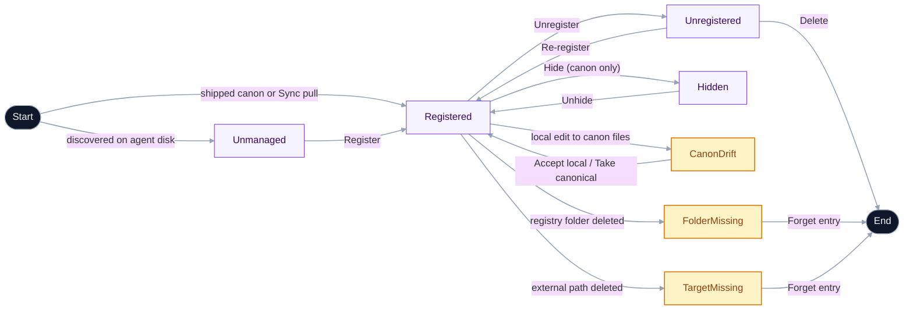

# Concepts

The vocabulary the app uses, defined in one place. Skim this once and the rest of the docs (and the UI itself) become a lot more obvious.

## Taxonomy

Every skill the app knows about sits on four orthogonal axes. Operations and UI gating derive from these axes, not from ad-hoc per-component checks.

- **Canon** — derived boolean. A skill is canon iff its name appears in the linked registry repo's upstream — the user's own GitHub repo for power persona, the bundled canonical set for convenience. Mutating canon requires write access to the linked repo; mutating a skill's canon-ness locally is impossible. Resolved dynamically against the active linked repo (not from stale per-skill markers).
- **Registered** — boolean. The skill has an entry in the local registry index. Mutated freely. Holds local-only metadata (tags, install paths, the Adopted flag).
- **Adopted** — boolean on each registry entry. When `true`, the skill's files physically live under `<registryRoot>/skills/<name>/`. When `false`, the registry entry tracks an external location and the files stay where they are. Default at register time is the `registerAdopts` setting (default `true`).
- **Installed** — derived from on-disk scan. A skill is installed if at least one agent dir contains an entry at `<agentDir>/<name>`. Per-agent kinds: `ours`, `foreign-symlink`, `real-directory`, `broken-symlink`.

### Derived rules

- Canon ⇒ registered by default. Unregister and delete of canon skills are prohibited; the user-visible escape is **hide**, scoped per linked-repo.
- Non-canon + registered + uninstalled is valid. Re-install requires the original source (no upstream to pull from).
- Registered + broken/conflicting installations ⇒ heal flow with explicit choices.
- Unregister of an adopted skill expels its files to the `unregisterDestinationAgent` setting (default `~/.agents/skills/`). Unregister of a non-adopted skill removes the index entry; origin files are untouched.

### Lifecycle

The four axes are orthogonal, but a skill's lifecycle reduces to a small ladder: **Unmanaged → Registered → Unregistered → Deleted**. Canon, Adopted, External, and Hidden are *attributes* of the Registered position, not separate lifecycle states. The diagram below shows that ladder and pulls the heal-pending states (highlighted) out as side arms so the recovery actions are visible.

Labels match the in-app vocabulary: nodes are lifecycle positions, transitions are the action buttons that move a skill between them. The dimensions the diagram doesn't show — *whether* a Registered skill is canon, adopted, or external — are read off the [Source](#source) and [card badges](#card-badges) sections.

### Destructive-action ladder

Three actions form an escalation, with distinct file/recovery semantics. Each tier physically separates from the next: Delete is only reachable on **unregistered** skills, so the user must Unregister first.

| Action | Where | Files | Agent symlinks | Recovery |
|---|---|---|---|---|
| Manage agent links | Drawer | untouched | added/removed per-agent via checkboxes (untick all = full uninstall) | re-add via the same modal |
| [Unregister](flows/unregister.md) | Drawer | adopted: moved to the configured agents dir; non-adopted: untouched | adopted: rewritten to point at the new location; non-adopted: untouched | re-register from new location |
| Delete | Installed tab → Unregistered section (inline button on the card, with confirmation) | real-directory copies removed; symlink targets preserved | symlinks unlinked | canon: re-pull; non-canon: gone (modulo export) |

Canon skills are exempt: Unregister and Delete are prohibited entirely. Use **Hide** instead — see [personas.md](personas.md#canon-protection-hide-instead-of-unregisterdelete).

## Skill

A folder containing instructions (`SKILL.md`) and optional metadata (`meta.json`) that an AI agent — Claude Code, Cursor, Gemini, etc. — picks up at runtime to gain a specialized capability. A skill is just files on disk; nothing about it requires this app to exist.

## Agent directory

Every supported AI agent reads skills from a fixed directory under your home folder:

| Agent | Directory |
|---|---|
| Claude Code | `~/.claude/skills/` |
| Cursor | `~/.cursor/skills/` |
| Gemini | `~/.gemini/skills/` |
| GitHub Copilot | `~/.copilot/skills/` |
| Continue | `~/.continue/skills/` |
| Cline | `~/.cline/skills/` |
| OpenAI Codex | `~/.codex/skills/` |
| Shared (any) | `~/.agents/skills/` |

Skills Bank scans every one of these. If a directory doesn't exist on your machine, it's just skipped — no error, no prompt.

## Registry

The **persisted, metadata-tagged collection of skills this app manages.** It's a folder of skill subfolders (`<repo>/skills/<name>/`) plus a generated index. Installing a skill from the registry creates a symlink in each of your agent directories pointing back at the registry's copy — no copies, no drift.

The registry is **not** the only source of skills you can use. Skills installed from elsewhere (e.g. via [skills.sh](https://skills.sh/)) appear alongside in the **Installed** tab and can be registered into Skills Bank if you want this app to manage them.

## Persona

A one-time decision made on first launch that determines how the app manages your registry:

- **Bundled registry** — Use the curated skill set shipped with this app. Pull updates with one click; add your own skills alongside. Export the registry to back it up or move it to another machine.
- **Your own registry** — Point the app at a GitHub repo you own and maintain. The app clones it locally and never auto-syncs it — you manage content through your normal git workflow.

Self-hosting (forking the entire app) is a developer path, not a runtime persona. See [self-host.md](self-host.md) for details.

Persona is persisted. You can switch via the account menu in the header. See [personas.md](personas.md) for a full feature comparison.

## Source

Each registry skill carries a `source` marker that records *where it came from*:

- **`canonical`** — Pulled from the upstream registry by Sync.
- **`user`** — Authored locally on this machine.
- **`imported`** — Imported from a power-persona repo replacement.

Markers live in a sibling `.skills-bank.json` per skill so they don't pollute upstream.

### Tags are local

Tags are a local-only dimension. You can add or remove tags on any skill — including the curated ones bundled with the app — and Sync will preserve your tag edits on the next pull. No protection step required: Sync reads the existing local tag list before writing the canonical content and splices it back in.

### Card badges

Each card surfaces a single badge — the most actionable signal from the taxonomy. Badges only appear when they communicate something that changes what you can or should do; non-actionable axes (hidden, adopted) have no badge.

Priority order, highest first:

- **`MISSING`** *(danger)* — files are gone. Open the drawer to **Forget this entry**.
- **`DRIFT`** *(warn)* — canonical local copy diverged from the synced commit. **Accept local changes** clears the canonical marker so Sync stops trying to overwrite.
- **`CANON`** *(calm)* — part of the linked registry's upstream set. Unregister and Delete are prohibited; use **Hide** to tuck it out of the default views.
- **`IMPORTED`** *(muted, dashed)* — non-canon, registered with `source: imported` (power-persona repo replacement).
- **`EXTERNAL`** *(accent, dashed)* — non-canon, registered with `adopted: false`. Files live outside Skills Bank; Unregister leaves origin files in place.
- **`YOURS`** *(accent)* — non-canon, user-authored, OR not in the registry. User-mutable; safe from Sync overwrites.

## Installation kind

Each installed skill is classified by what's at its agent-dir path:

- **`ours`** — A symlink that resolves into the app's registry. Owned by Skills Bank.
- **`real-directory`** — A regular folder of files (e.g. installed by another tool's CLI).
- **`foreign-symlink`** — A symlink to somewhere outside the registry.

The Installed tab uses these to decide which section a skill goes in (Registered vs Not registered) and which actions to offer (Uninstall, Register, Resolve conflicts).

## Conflict

A skill is in conflict when it's registered in Skills Bank **and** has stragglers — a real directory or foreign symlink with the same name in another agent dir. The drawer offers **Resolve conflicts** to clean them up: replace each duplicate with a symlink to the registry copy, keep it separate, or delete it.

## Sync (convenience persona)

A one-click pull of upstream registry updates. Sync is **upsert**: canonical skills refresh, skills you authored or imported are never touched. Name collisions surface a modal — keep yours, take theirs, or rename yours.

## Register

The act of adding an "installed but unmanaged" skill to the registry. What happens to the files depends on the **Adopted** axis, controlled by the `Move files into Skills Bank on Register` setting:

- **Adopted (default)** — files relocate to `<repo>/skills/<name>/`, the original agent-dir entry becomes a symlink pointing at the new registry location.
- **Not adopted** — the registry records the external path and leaves files where they are. Useful when a skill is actively maintained in its own git repo.

Either way the skill picks up registry metadata (tags, description, source marker).

## Adopt

A taxonomy axis on each registry entry. True when the skill's files physically live under `<repo>/skills/<name>/`; false when the entry tracks an external path. Set at register time from the global `Move files into Skills Bank on Register` setting. M4's unregister behavior diverges based on this flag — adopted skills get moved out to the shared agents dir; non-adopted skills leave their origin files alone.

## Finalize

Collapse a symlinked top-level agent dir (e.g. `~/.claude/skills` → `~/.agents/skills`) back into a real directory of its own. Used when you want each agent to own its skills independently after previously sharing.
