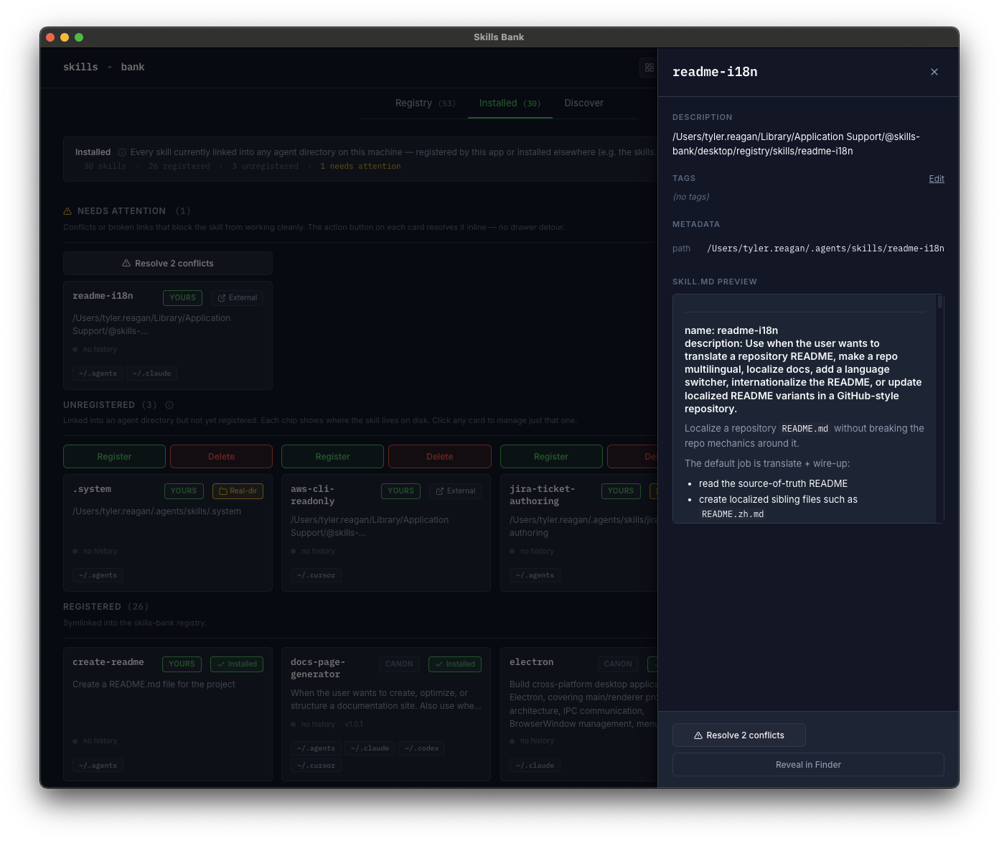
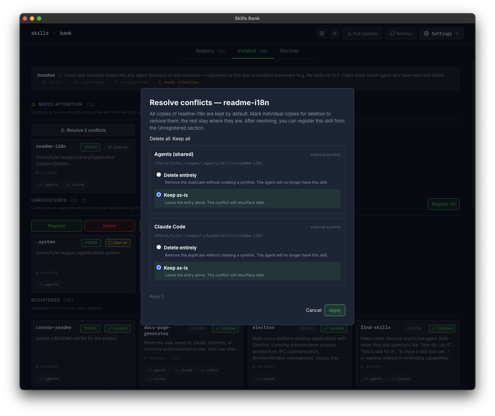

# Heal a skill in a bad state

Skills can land in states where the registry, on-disk files, and agent symlinks disagree. The detail drawer surfaces a single primary action per bad state with explanatory copy when there's only one reasonable recovery, or a multi-option modal when several are legitimate.

Every heal flow is the user's call — Skills Bank never auto-deletes content that might be intentional.

## The bad states

| State                       | Trigger                                                                                   | Primary heal                                                                                                                                                                                                                                               |
| --------------------------- | ----------------------------------------------------------------------------------------- | ---------------------------------------------------------------------------------------------------------------------------------------------------------------------------------------------------------------------------------------------------------- |
| **Install collision**       | Registered skill has a duplicate copy (real dir or foreign symlink) in another agent dir. | Resolve install collision modal (per-row choices: replace with symlink, delete, keep).                                                                                                                                                                     |
| **registered-broken**       | Registered skill has at least one broken symlink and no working `ours` copy.              | Try repair (find a usable source); fall back to delete-broken.                                                                                                                                                                                             |
| **registered-mixed-broken** | Registered + working symlinks AND broken symlinks.                                        | Repair the broken ones; the working ones stay.                                                                                                                                                                                                             |
| **Tracking ambiguity**      | Multiple non-`ours` copies of the same skill name exist across agents.                    | Pick the right copy via the resolve modal, then register.                                                                                                                                                                                                  |
| **unregistered-broken**     | Only broken-symlink copies exist for this name. Dead reference.                           | Delete the broken link.                                                                                                                                                                                                                                    |
| **bundled-skill-edited**    | Local copy of a bundled skill differs from the synced baseline.                           | Two arms: **Keep my edits** detaches from Sync (skill becomes yours, sync stops overwriting); **Revert to bundled** re-baselines the current state as the new synced version (drift clears, sync still owns the skill and can overwrite on the next pull). |
| **registry-folder-missing** | Adopted entry's `<repo>/skills/<name>/` folder is gone on disk.                           | **Forget this entry** — drops the registry record.                                                                                                                                                                                                         |
| **external-target-missing** | Non-adopted (symlink-mode) entry's external path is gone.                                 | **Forget this entry** — drops the external.json row. (Repointing the target is future work.)                                                                                                                                                               |

## How heal flows are surfaced

- **Single reasonable option**: the drawer renders one heal button with explanatory copy beneath it (no modal). Today this covers bundled-skill-edited, registry-folder-missing, and external-target-missing.
- **Multiple reasonable options**: the drawer opens a modal where the user makes per-row choices. Today this covers install collisions and tracking ambiguity (per-agent decisions: replace / delete / keep).
- **Hybrid (try-then-confirm)**: the drawer tries the cheap option first, then prompts if it fails. Today this covers broken symlinks: try to repoint at a usable source; if none, ask whether to delete.

The drawer's heal state is resolved by the same module the IPC handlers consult, so the renderer can't bypass an in-flight bad state.

### Install collisions — surfaced through the drawer

The drawer for an install collision replaces the usual Manage-agent-links primary action with a **Resolve install collision** button. The skill card behind the drawer carries a warning state.

Clicking **Resolve install collision** opens a per-agent modal. Each row shows what's currently at that path (real folder, foreign symlink, broken symlink) and the choice for that row: **Replace** with a symlink to the registry copy, **Delete** the stranger, or **Keep** as-is (and skip linking that agent).

### Bundled-skill-edited — surfaced through the drawer

The drawer for a bundled skill you've edited replaces the usual destructive area with two heal buttons — **Keep my edits** and **Revert to bundled** — under explanatory copy. The card carries the `DRIFT` badge. Both buttons clear the badge; the difference is _which copy survives_: Keep my edits detaches the skill from Sync (the skill becomes yours), while Revert to bundled re-baselines the synced hash so Sync still owns the skill and the next pull may overwrite local edits.

_Screenshot deferred — capture by editing a bundled skill's `SKILL.md` in the app's data dir (`~/Library/Application Support/@skills-bank/desktop/registry/skills/<name>/`) and refreshing the Registry tab._

### Conflict vocabulary

Three distinct collision types use distinct labels to avoid the overloaded "conflict" word:

- **Sync collision** — your local and the upstream bundled set both have a skill with the same name and different content. Resolved via the **Resolve sync collisions** modal after a Sync run.
- **Install collision** — a registered skill has a real-directory or foreign-symlink copy in an agent dir. Resolved via the **Resolve install collision** modal from the drawer.
- **Tracking ambiguity** — multiple non-ours copies of the same name across agents; registration is unclear. Resolved via the same drawer modal, with the symlink-replace action hidden.

A fourth type — **Merge collision** when merging another bank's folder into your active registry — currently shares the sync-collision modal; a follow-up audit will give it its own surface.

## Why not auto-resolve?

A "bad state" is often work the user placed somewhere on purpose — a manual fork, a one-off override, an experiment. The taxonomy plan calls this out explicitly: present choices when several are reasonable; force the single option with an explanation banner when there's only one. Skills Bank never silently mutates content under either path.
