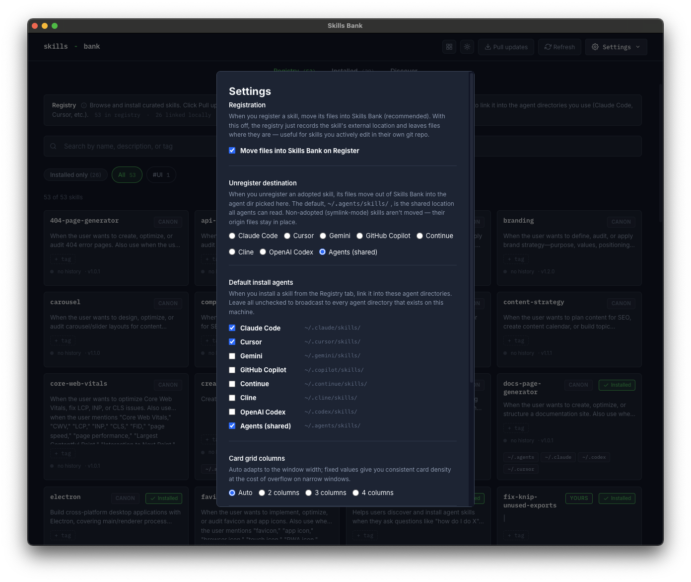

# Install a registry skill

> [!NOTE]
> Screenshots on this page predate the v1.5.1 dialog redesign and the v1.6.0 Account/Settings reshuffle. See [user-guide.md](../user-guide.md) for context.

The everyday flow. Browse the **Registry** tab, find a skill, link it into your agents.


## Steps

1. Open the **Registry** tab (it's the default tab).
2. Use the search bar or tag filters to narrow the list. Toggle **Installed only** to filter to skills you've already linked.
3. Click any card to open its detail dialog. The dialog shows the full `SKILL.md` preview, tags, source, and warnings if any.

   

4. Click **Install**.
5. Skills Bank creates a symlink at `<agent-dir>/<skill-name>` for every supported agent directory you have set up. By default, every existing agent dir gets a link.
6. Restart the affected agent (Claude Code, Cursor, …). The skill is available next session.

## Choosing which agents get the link

Open the account menu → **Settings…** → set **Default install agents** to a subset of agents. From then on, the Install button targets only those directories. Leave it empty to keep the default "broadcast to all existing dirs" behavior.



You can override per-skill from the dialog's **Manage agent links…** action — pick exactly which agents this one skill goes into.

## What gets created

For a skill named `my-skill` and agents Claude Code + Cursor:

```
~/.claude/skills/my-skill  →  <repo>/skills/my-skill/
~/.cursor/skills/my-skill  →  <repo>/skills/my-skill/
```

Both symlinks point at the same source folder. Edits to the registry copy are immediately visible to every linked agent — no copy step, no resync.

## Uninstall

Open the dialog for an installed skill → **Manage agent links…** → untick every agent → **Apply**. The symlinks are removed; the registry copy is left untouched. Reinstall any time without losing changes.

### Selective uninstall

The same **Manage agent links** modal drops a skill from a subset of agents while keeping it in the others — just untick the agents you want to remove and leave the rest checked. See [manage-links.md](manage-links.md) for the full action.
