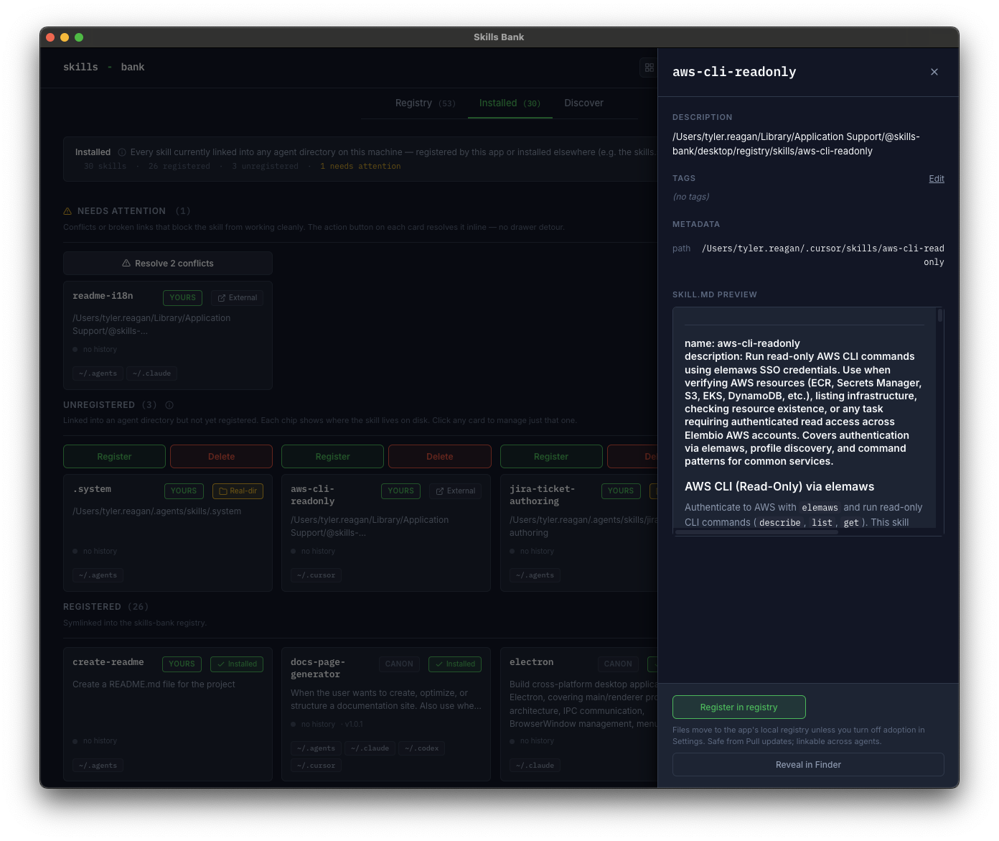

# Unregister a skill

You registered a skill into Skills Bank but want to back it out without nuking the files. Unregister is the mid-tier destructive action: it removes the registry entry and (for adopted skills) moves files out to your shared agents directory. Distinct from **Manage agent links** (which only adds or removes symlinks) and **Delete from Skills Bank** (which deletes files).

## Steps

1. Open the skill's detail drawer from any tab.
2. Click **Unregister** (between Reveal in Finder and Delete from Skills Bank).
3. What happens next depends on the **Adopted** axis:
   - **Adopted skill** — files move from `<repo>/skills/<name>/` to `~/.agents/skills/<name>/` by default. Agent-dir symlinks that pointed at the old bank location are rewritten to point at the new location, so installed agents keep working.
   - **Non-adopted (symlink-mode) skill** — just the registry index entry is removed. Origin files stay where they were; any symlinks to origin keep working.
4. A toast confirms the move. The first time you unregister an adopted skill, the toast also points you at the destination setting.

## Changing where files move

Settings → **Unregister destination**. Defaults to **Agents (shared)** which maps to `~/.agents/skills/`. You can pick any of the per-tool agent directories instead; Skills Bank moves files there on the next unregister. Non-adopted skills ignore this setting (their files don't move).

## Why unregister vs. delete?

| Action | Where | Files | Recovery |
|---|---|---|---|
| Manage agent links | Drawer | untouched | re-add via the same modal |
| **Unregister** | Drawer | adopted: moved to expulsion dir; non-adopted: untouched | re-register from new location |
| Delete | Installed tab → Unregistered section | files removed (symlink targets preserved) | canon: re-pull; non-canon: gone (modulo export) |

Use Unregister when you want to stop Skills Bank from managing a skill but keep the files around — either to hand the skill off to another tool, edit it directly outside of Skills Bank, or audit it before deletion. Delete is the bottom of the ladder and requires unregistration first; once unregistered, the skill appears in **Installed → Unregistered** with an inline **Delete** button (confirmation required).

## Canon skills

Unregistering a canon skill is prohibited (M5). Canon = your linked registry's upstream set. You can **hide** canon skills you don't want surfaced — see [personas.md](../personas.md#canon-is-repo-relative).
