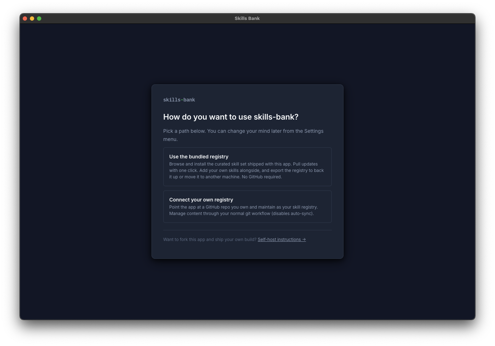
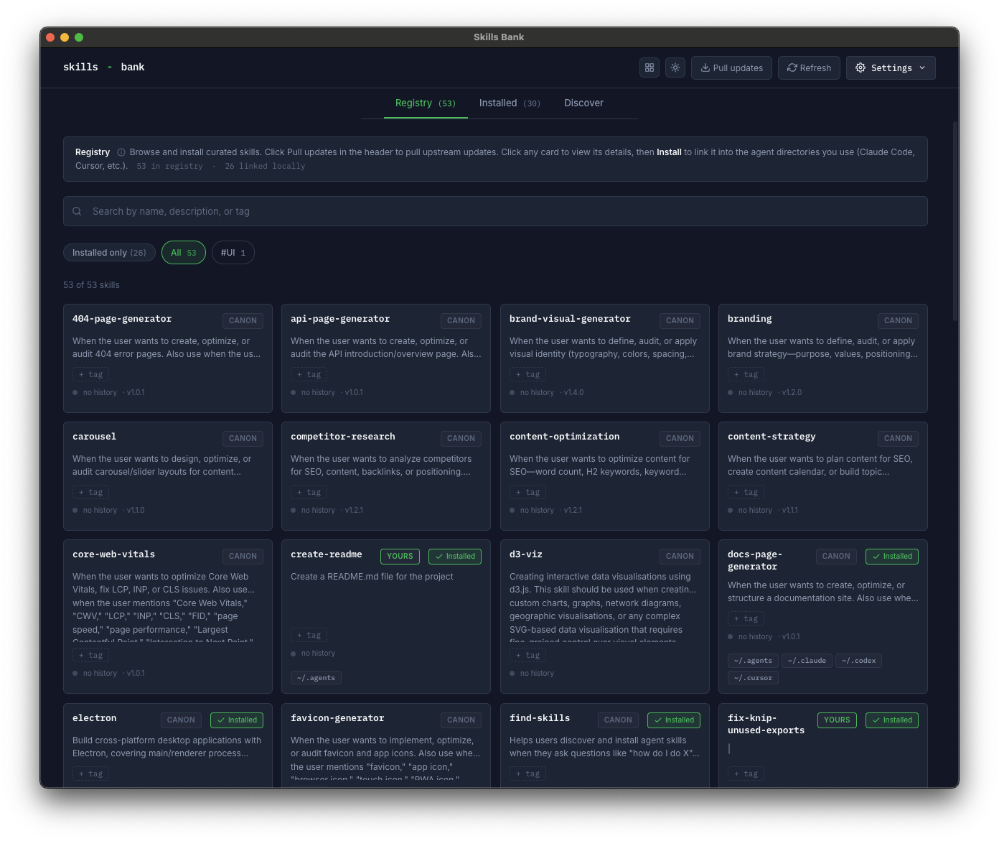
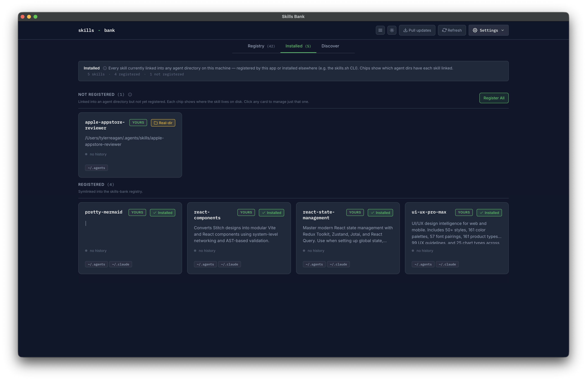

# Getting started

Skills Bank is a desktop app and CLI for managing [Claude Code](https://claude.ai/code) skills across every AI agent you use. This page gets you from "I downloaded the app" to "I'm using a skill in Claude Code" in five minutes.

## Install

Grab the latest DMG from the [Releases page](https://github.com/Tyler-Reagan/skills-bank/releases):

- `Skills-Bank-<version>-arm64.dmg` for Apple Silicon Macs
- `Skills-Bank-<version>.dmg` for Intel Macs

Open the DMG, drag **Skills Bank** to Applications, then launch from Spotlight. The build is unsigned, so the first launch needs **right-click → Open** to bypass macOS Gatekeeper. Subsequent launches are normal double-clicks.

The app auto-updates by polling the GitHub Releases feed on launch — when a new version is downloaded in the background, you'll see a "Restart" toast.

## First launch

You'll see a one-time setup screen with two sections.

**Use the bundled registry** *(recommended for most users)*
Browse and install the curated skill set shipped with this app. Pull updates with one click. Add your own skills alongside, and export the registry to back it up or move it to another machine. No GitHub required.

**Connect your own registry**
Point the app at a GitHub repo you own and maintain as your skill registry. The app clones it locally and never auto-syncs it — manage content through your normal git workflow. Not a fork of this app — just your own repo with a `skills/` directory.

Want to fork the entire app and ship your own build? See [self-host.md](self-host.md).

You can change your mind later via the account menu in the header. See [personas.md](personas.md) for a detailed feature comparison by registry choice.

## Use a skill in Claude Code

1. Open the **Registry** tab (it's the default).
2. Click any card to open the detail drawer.
3. Click **Install**. Skills Bank symlinks the skill into every agent directory you have set up — `~/.claude/skills/`, `~/.cursor/skills/`, etc.
4. Restart Claude Code (or Cursor, Gemini, …). The new skill is available next session.

Want to install only into specific agent directories instead of all of them? Open the account menu → **Settings…** → set **Default install agents**.

## See everything that's already installed

Open the **Installed** tab. You'll see two sections:

- **Registered** — skills installed via Skills Bank (or otherwise linked to the registry)
- **Not registered** — skills installed by other tools (e.g. `npx skills add` from [skills.sh](https://skills.sh/))

Click any "Not registered" card to manage it: register it into Skills Bank, link it into other agents, or fix broken links.

## Next steps

- [`concepts.md`](concepts.md) — terms you'll see throughout the app (registry, persona, source, agent dir).
- [`flows/`](flows/) — task-oriented walkthroughs for installing, registering, syncing, and resolving conflicts.
- [`keyboard.md`](keyboard.md) — keyboard shortcuts reference.
- [`troubleshooting.md`](troubleshooting.md) — common problems and how to recover.
