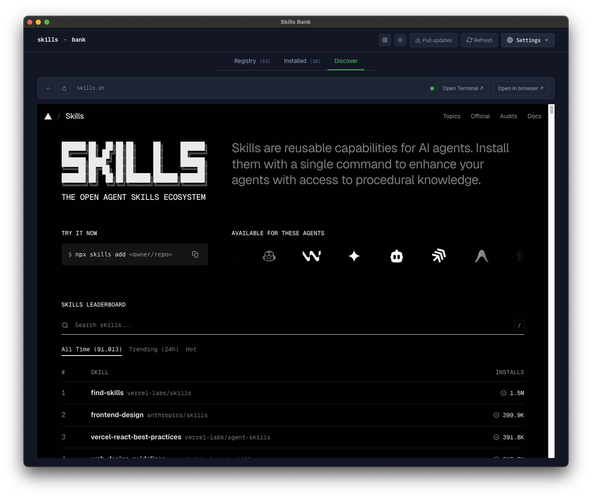
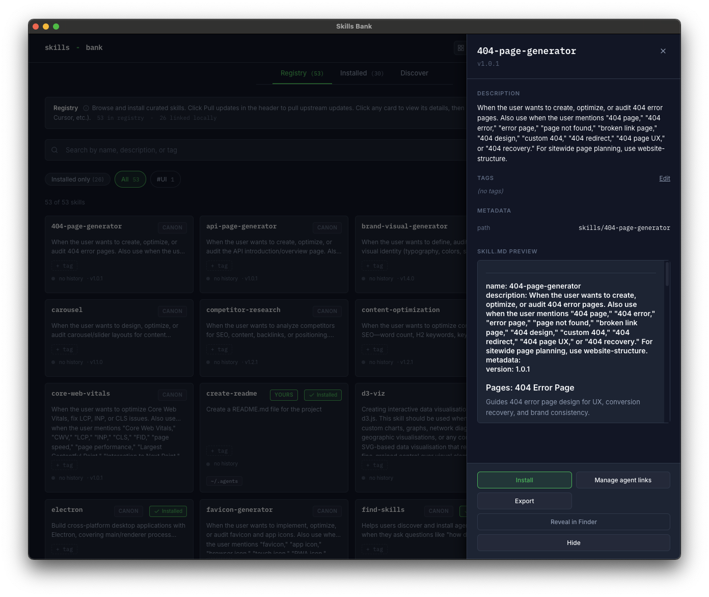

# Skills Bank user guide

This page is an index. Pick whichever doc matches what you're trying to do.

## Start here

- **[`getting-started.md`](getting-started.md)** — From "I downloaded the app" to "I'm using a skill in Claude Code" in five minutes.
- **[`concepts.md`](concepts.md)** — The vocabulary the UI uses: skill, registry, persona, source, publish state, conflict, …

## A quick tour

The desktop app is organized into three tabs in the header:

| Tab                                                      | What it shows                                                             |
| -------------------------------------------------------- | ------------------------------------------------------------------------- |
| **Registry** ([`flows/install.md`](flows/install.md))    | Curated skills you can install with one click.                            |
| **Installed** ([`flows/register.md`](flows/register.md)) | Skills currently linked into your agents — both registered and unmanaged. |
| **Discover**                                             | The wider [skills.sh](https://skills.sh/) ecosystem, embedded.            |

<table>
<tr>
<td> <b>Installed</b> — see Registered and Not registered sections side-by-side</td>
<td> <b>Discover</b> — skills.sh, embedded, with Open Terminal / Open in browser shortcuts</td>
</tr>
</table>

Click any card to open its detail drawer:

## Day-to-day flows

- [`flows/install.md`](flows/install.md) — Browse the Registry tab and link a skill into your agents.
- [`flows/register.md`](flows/register.md) — Bring an externally-installed skill under Skills Bank's management.
- [`flows/unregister.md`](flows/unregister.md) — Back a skill out of the registry without deleting files.
- [`flows/manage-links.md`](flows/manage-links.md) — Add or drop a skill from individual agent dirs.
- [`flows/heal.md`](flows/heal.md) — Recover from any bad state (conflicts, broken links, missing files, canon drift).
- [`flows/sync.md`](flows/sync.md) — Pull upstream registry updates (convenience persona).
- [`flows/login.md`](flows/login.md) — The first-launch persona choice and how to switch later.

### Managing canon skills

Canon skills (those that come from your linked registry's upstream) can't be unregistered or deleted from Skills Bank — those operations would be irrecoverable since the upstream owns them. Use **Hide** in the detail drawer to tuck a canon skill out of the default Browse view while keeping its installations and metadata intact. Manage your hide list in Settings → **Hidden canon skills**.

## Reference

- [`keyboard.md`](keyboard.md) — Keyboard shortcuts.
- [`troubleshooting.md`](troubleshooting.md) — Common problems and how to recover.
- [`self-host.md`](self-host.md) — Fork and ship your own build.
- [`meta-schema.json`](meta-schema.json) — JSON schema for `meta.json` in skill folders.

## App vs registry updates

These are independent paths:

- **App updates** arrive via auto-update. The app polls the GitHub Releases feed on launch; when a new version downloads in the background, a "Restart" toast lets you apply it.
- **Registry updates** (convenience persona) arrive via the Sync button. They never trigger an app restart.

You can update one without the other.
