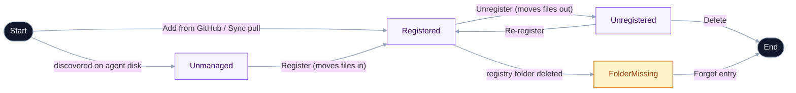

# Concepts

The vocabulary the app uses, defined in one place. Skim this once and the rest of the docs (and the UI itself) become a lot more obvious.

## The three verbs

A skill moves through the app along a short pipeline. Three orthogonal verbs move it, distinguished by _where the content comes from_ and _where it goes_:

- **Add** brings a skill in from a remote (a GitHub repo) into your registry.
- **Register** brings a skill that's already on local disk into your registry.
- **Install** symlinks a skill that's in your registry out into your agent directories.

Everything else — Unregister, Uninstall, Update, Detach — is an inverse or a variation of these. The Discover-tab "Add from GitHub" flow is Add with Register and Install composed as its mechanics.

## Taxonomy

Every skill the app knows about sits on a few orthogonal facts. Operations and UI gating derive from these, not from ad-hoc per-component checks.

- **Registered** — boolean, and the load-bearing one: **a skill is Registered if and only if its files live under `<registryRoot>/skills/`.** There's no "track it where it already lives" mode — Register moves files into the bank, Unregister moves them out.
- **Origin** — a single nullable URL: the GitHub URL the skill was mirrored from, or `null` for a local skill with no remote. See [Origin (provenance)](#origin-provenance).
- **Bucket** — which subtree the skill's folder lives in, `personal` or `vendored`, derived once from Origin at acquisition. See [Bucket](#bucket).
- **Installed** — derived from an on-disk scan. A skill is installed if at least one agent dir has an entry at `<agentDir>/<name>`. Per-agent kinds: `ours`, `foreign-symlink`, `real-directory`, `broken-symlink`.

### Derived rules

- A registered but uninstalled skill is valid — it's in the bank, just not symlinked into any agent yet. Install links it out.
- Registered + broken or conflicting installations ⇒ a heal flow with explicit choices.
- Unregister always moves the skill's files out to the `unregisterDestinationAgent` directory (default `~/.agents/skills/`) and repoints any agent symlinks at the new location.

### Lifecycle

A skill's lifecycle is a short ladder: **Unmanaged → Registered → Unregistered → Deleted**. Origin and Bucket are _attributes_ of a registered skill, not separate lifecycle positions.

Labels match the in-app vocabulary: nodes are lifecycle positions, transitions are the action buttons that move a skill between them.

### Destructive-action ladder

Three actions form an escalation, with distinct file/recovery semantics. Delete is only reachable on **unregistered** skills, so the user must Unregister first.

| Action                           | Where                                | Files                                                    | Agent symlinks                         | Recovery                      |
| -------------------------------- | ------------------------------------ | -------------------------------------------------------- | -------------------------------------- | ----------------------------- |
| Manage agent links               | Dialog                               | untouched                                                | added/removed per-agent via checkboxes | re-add via the same modal     |
| [Unregister](/guides/unregister) | Dialog                               | moved out to the configured agents dir                   | rewritten to point at the new location | re-register from new location |
| Delete                           | Installed tab → Unregistered section | real-directory copies removed; symlink targets preserved | symlinks unlinked                      | re-Add from origin, or gone   |

## Skill

A folder containing a `SKILL.md` — instructions plus metadata in YAML frontmatter — that an AI agent — Claude Code, Cursor, Gemini, etc. — picks up at runtime to gain a specialized capability. A skill is just files on disk; nothing about it requires this app to exist. (The frontmatter is the sole metadata source; the app neither writes nor reads any `meta.json` — see [Skill metadata](/reference/skill-metadata).)

## Agent directory

Every supported AI agent reads skills from a fixed directory under your home folder:

| Agent          | Directory             |
| -------------- | --------------------- |
| Claude Code    | `~/.claude/skills/`   |
| Cursor         | `~/.cursor/skills/`   |
| Gemini         | `~/.gemini/skills/`   |
| GitHub Copilot | `~/.copilot/skills/`  |
| Continue       | `~/.continue/skills/` |
| Cline          | `~/.cline/skills/`    |
| OpenAI Codex   | `~/.codex/skills/`    |
| Shared (any)   | `~/.agents/skills/`   |

Skills Bank scans every one of these. If a directory doesn't exist on your machine, it's just skipped — no error, no prompt.

## Registry

The **persisted, metadata-tagged collection of skills this app manages.** It's a folder of skill subfolders (`<repo>/skills/<bucket>/<name>/`) plus a generated index. Installing a skill from the registry creates a symlink in each of your agent directories pointing back at the registry's copy — no copies, no drift.

The registry is **not** the only source of skills you can use. Skills installed from elsewhere (e.g. via [skills.sh](https://skills.sh/)) appear alongside in the **Installed** tab and can be registered into Skills Bank if you want this app to manage them.

## Linked repo

Every install starts empty — there's no default skill set. Add skills via the **Discover** tab, author them locally, or sign in via **Account** and **Link a GitHub repository** you own as your registry. The bank reads the linked repo's contents by file convention (any folder with a `SKILL.md` — its YAML frontmatter carries the metadata) — its layout doesn't have to match anything specific.

Self-hosting (forking the entire app) remains a separate developer path; see [Self-hosting](/self-host).

## Origin (provenance)

A skill's provenance is a **single nullable URL** — the GitHub URL it was mirrored from, or `null` for a local skill with no remote. It lives in one place: the skill's row in the registry manifest. There's no separate "source" classification and no per-skill sidecar file.

- A URL that matches your active **Linked repo** is a _self-origin_ — a skill authored here.
- Any other URL is an _external upstream_ — a third-party skill you Added; the app can surface updates from it via the origin probe.
- `null` is an explicit "local, no remote" stamp — a valid resting state, not an error. It's what a from-scratch skill or a [Detached](#detach) skill carries.

## Bucket

Which subtree a skill's folder lives in under `<registryRoot>/skills/`: `personal` (self-originated — Origin is `null` or matches the Linked repo) or `vendored` (external Origin). The bucket is derived **once, at acquisition**, from Origin; thereafter the folder's location is the record. Re-linking to a fork or a renamed repo moves no folders and relabels nothing. The **Personal** and **Vendored** filter chips on the Registry tab key off the bucket.

## Labels

Every skill carries two label axes, both user-assigned and editable per-skill from the detail drawer or in bulk from the **Manage Labels** modal.

- **Category** — at most one per skill, drawn from a fixed function-oriented taxonomy (what a skill _does_ — e.g. `engineering:code-scaffolding` — not what technology it touches). Skills in the Registry tab are grouped under collapsible category section headers; skills with no category assigned appear under **Uncategorized**. Change a skill's category from the **Labels** section of its detail drawer; the new grouping takes effect immediately.
- **Tags** — zero or more per skill, fully freeform. Tags power the tag filter bar and are matched during free-text search. You can add or remove tags on any skill, and they persist across registry syncs.

Both axes are stored in `labels.json` under the app's data directory. Assignment is always manual — there's no auto-suggestion tool for either axis.

See [Skill labels](/reference/labels) for the full list of categories, tags, and how to manage them in bulk.

### Card badges

Each card surfaces a single badge, drawn from the skill's actionable state. Priority order, highest first:

- **`MISSING`** _(danger)_ — files are gone. Open the dialog to **Forget this entry**.
- **`UNREACHABLE`** _(danger)_ — the skill's origin hasn't answered the last few update probes. Your local copy is intact.
- **`UPDATE`** _(info)_ — an update is available from the skill's origin. Skills you've edited locally are held out of one-click updates (files the skill ignores via its own `.gitignore`, e.g. a runtime-installed `node_modules/`, don't count as edits).

## Add

Acquire a skill from a remote source (today, a GitHub repo) into your registry. Add mirrors the skill's content into the Bucket tree (an external Origin lands in `vendored`), records its Origin URL and a baseline content hash, and installs it into your default agent directories. Surfaced as **"Add from GitHub"** on the Discover tab. "Install" deliberately names only the agent-symlink step that Add finishes with — not the whole operation.

## Register

Bring a skill that's already on local disk into the registry — for example a skill another tool's CLI dropped into an agent dir. Register **moves the skill's files** into `<registryRoot>/skills/personal/<name>/`, records a manifest row, and repoints the agent-dir entry as a symlink to the in-bank copy. One verb, one effect. Since Registered means "files live under `skills/`," there is no separate "adopt" or "move into bank" step — registering _is_ moving into the bank.

Register differs from Add only in where the content starts: Register's source is already on your disk; Add's arrives from a remote.

## Install / Uninstall

**Install** symlinks a registered skill's folder into one or more agent directories — multi-agent by default, into every agent dir that exists. **Uninstall** removes an agent-dir symlink (Install's inverse); it's reached through **Manage agent links** (unchecking an agent), never as a standalone destructive button, and happens automatically as a side effect of Unregister and Delete.

## Installation kind

Each installed skill is classified by what's at its agent-dir path, resolving symlink chains to their final target:

- **`ours`** — A symlink that resolves into the app's registry. Owned by Skills Bank.
- **`real-directory`** — A regular folder of files (e.g. installed by another tool's CLI).
- **`foreign-symlink`** — A symlink to somewhere outside the registry.
- **`broken-symlink`** — A symlink whose target no longer exists.

The Installed tab uses these to decide which section a skill goes in (Registered vs Unregistered) and which actions to offer (Register, Manage agent links, Resolve conflicts, repair broken links).

## Conflict

A skill is in conflict when the same name has more than one non-`ours` installation across agent dirs — a real directory or foreign symlink alongside the registry copy, or multiple candidate copies with no registry entry yet. The detail dialog offers **Resolve conflicts**: replace each straggler with a symlink to the registry copy, keep it separate, or delete it. This is the only thing called a "conflict" in the app; the unrelated name-collision handling inside a Sync pull is a separate mechanism.

## Detach

Sever a skill's Origin while keeping its local content: sets Origin to `null`, re-baselines the drift hash so the now-local copy reads as clean, and moves the folder from `vendored` to `personal`. Surfaced as **"Keep my edits (detach)"** (from a drift state) or **"Keep local (detach)"** (from the Restore-origin modal when an upstream has gone unreachable). A detached skill is local-only until it's re-homed into your Linked repo via a pull request, which gives it a self-Origin again.

## Sync

A one-click pull of updates from your Linked repo. Sync is a **three-way merge** (base, yours, theirs), not a blind overwrite — local-only skills are never read as "deleted upstream," and genuine divergences surface in a conflict modal where you choose keep-mine, use-theirs, or keep-both. Direct push is guarded against clobbering a diverged remote.

## Finalize

Collapse a symlinked top-level agent dir (e.g. `~/.claude/skills` → `~/.agents/skills`) back into a real directory of its own. Used when you want each agent to own its skills independently after previously sharing.

## Manifest

A lightweight JSON snapshot of a registry's **origin pointers** — not the skill content itself. Each entry carries the skill's name, its Origin (URL + skill path + hash), and its curation labels (category + tags). On import, each skill is re-fetched from its origin, so transfers are tiny but require the origins to still be reachable.

The manifest is the live record of what the registry manages — updated on every mutating operation — and also the transport layer for moving a registry's _metadata_ between machines or pushing it to a linked repo. Content transfers (the full skills tree as files) use the disk import flow instead.

The current schema is v6. A manifest exported from one machine can be pushed directly to your linked GitHub repo and pulled on another, closing the loop without manual file handling. See [Move your registry](/guides/manifest).
