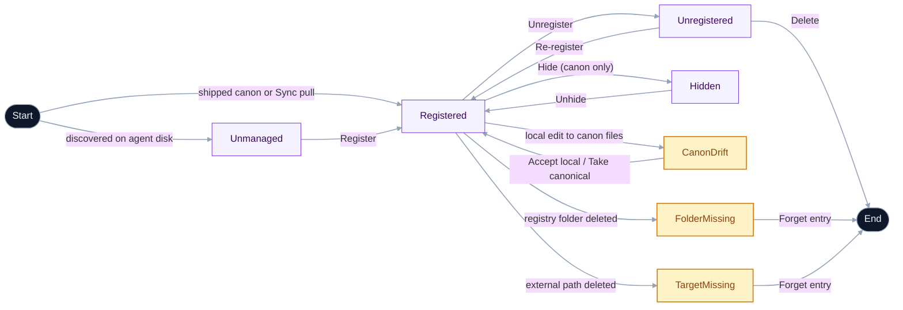

# Concepts

The vocabulary the app uses, defined in one place. Skim this once and the rest of the docs (and the UI itself) become a lot more obvious.

> [!NOTE]
> This document is the user-facing concept guide. The engineering glossary — including precise "aliases to avoid" lists, the canonical operation verbs, and flagged ambiguities the codebase has worked through — lives in [`UBIQUITOUS_LANGUAGE.md`](https://github.com/Tyler-Reagan/skills-bank/blob/main/UBIQUITOUS_LANGUAGE.md) on GitHub. When the two documents disagree, UL is canonical.

## Taxonomy

Every skill the app knows about sits on four orthogonal axes. Operations and UI gating derive from these axes, not from ad-hoc per-component checks.

- **Source (provenance)** — binary user-facing axis. Either `curated` (came from the curated set the bank tracks) or `user` (you added it, however it got there). See [Source (provenance)](#source-provenance) below for full surface behavior.
- **Registered** — boolean. The skill has an entry in the local registry index. Mutated freely. Holds local-only metadata (tags, install paths, the Adopted flag).
- **Adopted** — boolean on each registry entry. When `true`, the skill's files physically live under `<registryRoot>/skills/<name>/`. When `false`, the registry entry tracks an external location and the files stay where they are. Default at register time is the `registerAdopts` setting (default `true`).
- **Installed** — derived from on-disk scan. A skill is installed if at least one agent dir contains an entry at `<agentDir>/<name>`. Per-agent kinds: `ours`, `foreign-symlink`, `real-directory`, `broken-symlink`.

### Derived rules

- Curated skills are registered by default. Unregister and delete of curated skills are prohibited; the user-visible escape is **Dismiss from registry view**, scoped per linked-registry.
- A registered but uninstalled `user` skill is valid. Re-install requires the original source (no upstream to pull from).
- Registered + broken/conflicting installations ⇒ heal flow with explicit choices.
- Unregister of an adopted skill expels its files to the `unregisterDestinationAgent` setting (default `~/.agents/skills/`). Unregister of a non-adopted skill removes the index entry; origin files are untouched.

### Lifecycle

The four axes are orthogonal, but a skill's lifecycle reduces to a small ladder: **Unmanaged → Registered → Unregistered → Deleted**. Provenance (curated/user), Adopted, External, and Dismissed are _attributes_ of the Registered position, not separate lifecycle states.

Labels match the in-app vocabulary: nodes are lifecycle positions, transitions are the action buttons that move a skill between them.

### Destructive-action ladder

Three actions form an escalation, with distinct file/recovery semantics. Delete is only reachable on **unregistered** skills, so the user must Unregister first.

| Action                           | Where                                | Files                                                               | Agent symlinks                                                      | Recovery                      |
| -------------------------------- | ------------------------------------ | ------------------------------------------------------------------- | ------------------------------------------------------------------- | ----------------------------- |
| Manage agent links               | Dialog                               | untouched                                                           | added/removed per-agent via checkboxes                              | re-add via the same modal     |
| [Unregister](/guides/unregister) | Dialog                               | adopted: moved to the configured agents dir; non-adopted: untouched | adopted: rewritten to point at new location; non-adopted: untouched | re-register from new location |
| Delete                           | Installed tab → Unregistered section | real-directory copies removed; symlink targets preserved            | symlinks unlinked                                                   | curated: re-pull; user: gone  |

Curated skills are exempt: Unregister and Delete are prohibited entirely. Use **Dismiss from registry view** instead.

## Skill

A folder containing a `SKILL.md` — instructions plus metadata in YAML frontmatter — that an AI agent — Claude Code, Cursor, Gemini, etc. — picks up at runtime to gain a specialized capability. A skill is just files on disk; nothing about it requires this app to exist. (As of v1.15.0 the frontmatter is the sole metadata source; a `meta.json` may still appear as an app-synthesized artifact for agents that read one — see [Skill metadata](/reference/skill-metadata).)

## Agent directory

Every supported AI agent reads skills from a fixed directory under your home folder:

| Agent          | Directory             |
| -------------- | --------------------- |
| Claude Code    | `~/.claude/skills/`   |
| Cursor         | `~/.cursor/skills/`   |
| Gemini         | `~/.gemini/skills/`   |
| GitHub Copilot | `~/.copilot/skills/`  |
| Continue       | `~/.continue/skills/` |
| Cline          | `~/.cline/skills/`    |
| OpenAI Codex   | `~/.codex/skills/`    |
| Shared (any)   | `~/.agents/skills/`   |

Skills Bank scans every one of these. If a directory doesn't exist on your machine, it's just skipped — no error, no prompt.

## Registry

The **persisted, metadata-tagged collection of skills this app manages.** It's a folder of skill subfolders (`<repo>/skills/<name>/`) plus a generated index. Installing a skill from the registry creates a symlink in each of your agent directories pointing back at the registry's copy — no copies, no drift.

The registry is **not** the only source of skills you can use. Skills installed from elsewhere (e.g. via [skills.sh](https://skills.sh/)) appear alongside in the **Installed** tab and can be registered into Skills Bank if you want this app to manage them.

## Linked repo vs bundled default

Every install starts on the **bundled default** — the app reads the canonical curated set from `Tyler-Reagan/skills-bank` at the unauthenticated GitHub rate limit (60/hr). Refresh pulls the latest. No GitHub account needed.

Sign in via **Account** to either keep the curated set at a higher rate limit (5000/hr authenticated, plus access to private repos) or **Link a GitHub repository** you own as your registry. The bank reads the linked repo's contents by file convention (any folder with a `SKILL.md` — its YAML frontmatter carries the metadata) — its layout doesn't have to match anything specific.

Self-hosting (forking the entire app) remains a separate developer path; see [Self-hosting](/self-host).

## Source (provenance)

Provenance is a three-value axis on each registry skill, stored as `source` in a sibling `.skills-bank.json` per skill so the marker doesn't pollute upstream.

- **`curated`** — Part of the committed curated set the app ships. Reserved for `.skills-bank.json` files committed to the app's registry repo — no install or sync path ever mints a new one. Sync keeps these current.
- **`vendored`** — A third-party skill you chose to bring in, with its origin pointer preserved so updates from the original author still surface.
- **`user`** — Yours — authored locally, merged in from another bank's export, or pulled from your own linked repo. Sync never touches it.

## Labels

Every skill carries two label axes, both user-assigned and editable per-skill from the detail drawer or in bulk from the **Manage Labels** modal.

- **Category** — at most one per skill. Skills in the Browse tab are grouped under collapsible category section headers (Frontend, Backend, Infrastructure, …); skills with no category assigned appear under **Uncategorized**. Change a skill's category from the **Labels** section of its detail drawer; the new grouping takes effect immediately.
- **Tags** — zero or more per skill. Tags power the tag filter bar and are matched during free-text search. You can add or remove tags on any skill — including curated ones — and they persist across registry syncs.

Both axes are stored in `labels.json` under the app's data directory. The **Auto-Generate** tool (in Manage Labels) can suggest category and tag values from a skill's name and description on demand; suggestions are always reviewed before saving.

See [Skill labels](/reference/labels) for the full list of categories, tags, and how to manage them in bulk.

### Card badges

Each card surfaces a single badge. Actionable state badges take priority; provenance is shown only for curated skills.

Priority order, highest first:

- **`MISSING`** _(danger)_ — files are gone. Open the dialog to **Forget this entry**.
- **`UNREACHABLE`** _(danger)_ — the skill's origin hasn't answered the last few update probes. Your local copy is intact.
- **`UPDATE`** _(info)_ — an update is available from the skill's origin. Skills you've edited locally are held out of one-click updates (files the skill ignores via its own `.gitignore`, e.g. a runtime-installed `node_modules/`, don't count as edits).
- **`CURATED`** _(calm)_ — part of the curated set. Destructive verbs are gated; **Dismiss from registry view** is the curated-only escape hatch.

User-source skills render no provenance chip. The **Personal** filter chip on the Registry tab shows only user-source skills.

## Installation kind

Each installed skill is classified by what's at its agent-dir path:

- **`ours`** — A symlink that resolves into the app's registry. Owned by Skills Bank.
- **`real-directory`** — A regular folder of files (e.g. installed by another tool's CLI).
- **`foreign-symlink`** — A symlink to somewhere outside the registry.

The Installed tab uses these to decide which section a skill goes in (Registered vs Not registered) and which actions to offer (Uninstall, Register, Resolve conflicts).

## Conflict

A skill is in conflict when it's registered in Skills Bank **and** has stragglers — a real directory or foreign symlink with the same name in another agent dir. The detail dialog offers **Resolve conflicts** to clean them up: replace each duplicate with a symlink to the registry copy, keep it separate, or delete it.

## Sync

A one-click pull of upstream registry updates. Sync is **upsert**: curated skills refresh, skills with `source: user` are never touched. Name collisions surface a modal — keep mine, use curated, or rename mine.

## Register

The act of adding an "installed but unmanaged" skill to the registry. What happens to the files depends on the **Adopted** axis, controlled by the `Move files into Skills Bank on Register` setting:

- **Adopted (default)** — files relocate to `skills/personal/<name>/` under your registry root, the original agent-dir entry becomes a symlink pointing at the new registry location.
- **Not adopted** — the registry records the external path and leaves files where they are. Useful when a skill is actively maintained in its own git repo.

Either way the skill picks up registry metadata (tags, description, source marker).

## Adopt

A taxonomy axis on each registry entry. True when the skill's files physically live under `skills/{personal,vendored}/<name>/` in the registry root; false when the entry tracks an external path. Set at register time from the global `Move files into Skills Bank on Register` setting. Unregister behavior diverges based on this flag — adopted skills get moved out to the shared agents dir; non-adopted skills leave their origin files alone.

## Finalize

Collapse a symlinked top-level agent dir (e.g. `~/.claude/skills` → `~/.agents/skills`) back into a real directory of its own. Used when you want each agent to own its skills independently after previously sharing.

## Vendor

Pulling a third-party skill from its origin GitHub repo into the bank, preserving the origin pointer so future updates from the original author still surface via the update probe. Vendored skills live under `skills/vendored/<name>/`. The CLI counterpart is `pnpm bank vendor`; the bulk-refresh counterpart is `pnpm bank refresh`. Vendoring does NOT take ownership — the user is mirroring, not forking.

## Manifest

A lightweight JSON snapshot of a registry's **origin pointers** — not the skill content itself. Each entry carries the skill's name, source axis, bucket, origin pointer (repo + path), and curation labels (category + tags). On import, each skill is re-fetched from its origin, so transfers are tiny but require the origins to still be reachable.

Manifests are the transport layer for moving a registry's _metadata_ between machines or pushing it to a linked repo. Content transfers (the full skills tree as files) use the disk import flow instead.

The current schema is v5. A manifest exported from one machine can be pushed directly to your linked GitHub repo and pulled on another, closing the loop without manual file handling. See [Move your registry](/guides/manifest).
